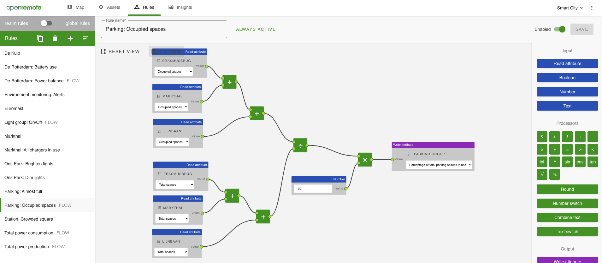

# Flow Rules

Flow rules are mainly intended for attribute linking and processing existing attributes, translating them into new virtual attributes. They can also function as regular event rules. They're useful for users who want to create rules in a visual manner but also need to define rules more complex than is possible in the WHEN-THEN (JSON) rules UI editor.

Flow rules can be created in a visual editor or written manually in their own JSON format.

## The Flow rules model

### Node collections

A Flow rule is an object that is stored in JSON and interpreted by the Manager. Flow rules are referred to as node collections in the back end. These are collections of connected nodes that can receive, process, and then output information. A node collection can be named and given a description, just like other rule types.

### Nodes and connections

A node is an entity that receives, manipulates, or outputs data via its sockets. Nodes are split into three categories.

**Input** nodes receive information from somewhere else to send it to other nodes in the collection. An example of an input node is a text node, that just outputs text that is put in by the user. A node that outputs asset attribute data is also an input node.

**Processors** receive information from other nodes, process it, then output it to other nodes. These nodes generally don't interact with anything outside the Flow editor. An example of a processor is a math node that outputs the sum of its inputs.

**Output** nodes receive information from other nodes and send it somewhere else. Generally, output nodes send information to the Manager. An example of this is a node that sets an asset attribute to a specific value.

Connections are laid by the user from socket to socket, allowing data to flow through. Connections define the interactions between each individual node, and so define the behaviour of the entire rule.

### Execution

Node collections are sent to the manager and converted into a rule. All rules have a condition and an action. The action is executed when the condition is met. A flow rule executes only when the value of an asset attribute on the left hand side of the rule has been changed. However, not all input nodes are included in the left hand side of a flow rule.

A flow rule is generated backwards. The system goes through every output node and traverses down the node tree, marking every asset attribute input node it comes across. For every output node, it constructs a single rule. Input nodes without attached output nodes aren't considered, neither are output nodes that aren't connected to input nodes. Detached processor nodes are ignored as well.

## See Also

- [Create Rules](create-rules.md)
- [Manager UI](../manager-ui/manager-ui.md)
